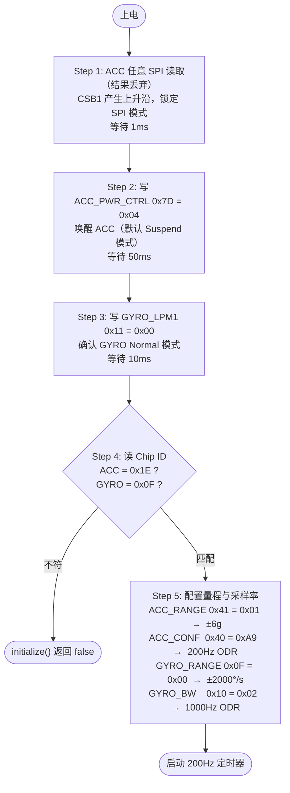
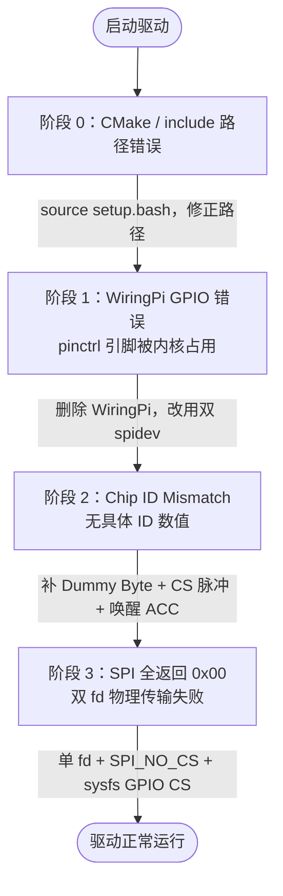
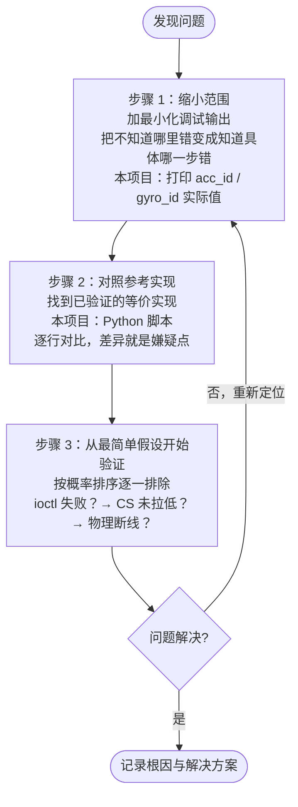

# BMI088 ROS 2 IMU 驱动开发全程记录

> [!info] 开发环境
> 平台：RDK X5 | 接口：SPI | 框架：ROS 2 Humble | 语言：C++17

---

## 一、最终架构：分层设计

### 1.1 逻辑层（做什么）

```
┌─────────────────────────────────────────────┐
│            ROS 2 应用层 (Bmi088Node)         │
│  • 200Hz 定时器触发采集                        │
│  • 发布 sensor_msgs/msg/Imu 到 imu/data_raw  │
│  • orientation_covariance[0] = -1.0          │
│    （声明本节点不提供姿态，交给下游 EKF）        │
└───────────────────┬─────────────────────────┘
                    │
┌───────────────────▼─────────────────────────┐
│          驱动层 (Bmi088Driver)               │
│  • 封装 BMI088 所有寄存器操作                  │
│  • 实现规格书规定的初始化状态机                  │
│  • 提供 initialize() / read_imu_data() 接口  │
└───────────────────┬─────────────────────────┘
                    │
┌───────────────────▼─────────────────────────┐
│              HAL 层（硬件抽象）               │
│  • SPI 通信：spidev + ioctl（无第三方库）      │
│  • CS 控制：sysfs GPIO（/sys/class/gpio/）   │
│  • 与 Python Hobot.GPIO 内部机制对齐          │
└─────────────────────────────────────────────┘
```

### 1.2 执行层（怎么做）

#### SPI 通信设计

| 操作 | ACC（加速度计）| GYRO（陀螺仪）|
|---|---|---|
| 写寄存器 | `[reg & 0x7F, value]`，2字节 | 同左 |
| 读单字节 | `[reg\|0x80, 0x00, 0x00]`，**3字节**，取 rx[2] | `[reg\|0x80, 0x00]`，2字节，取 rx[1] |
| 读数据（XYZ）| Burst Read，**8字节**，取 rx[2..7] | Burst Read，**7字节**，取 rx[1..6] |

> [!note] 为什么 ACC 多一个字节
> 规格书 §6.1.2 明确：ACC 在 SPI 读时序中会先吐出一个内容不可预测的 ==Dummy Byte==，真实数据从第二个字节开始。GYRO 无此行为。

#### CS 控制设计

```
单个 spidev fd（/dev/spidev1.0，SPI_NO_CS 模式）
         │
         ├── ACC CS  → sysfs GPIO 394（Physical 24，SPI1_CSN1）
         └── GYRO CS → sysfs GPIO 396（Physical 26，SPI1_CSN0）

操作流程（每次 SPI 事务）：
  write(cs_fd, "0") → ioctl(SPI_IOC_MESSAGE) → write(cs_fd, "1")
```

> [!tip] 性能关键
> value 文件 fd 在构造函数中==一次性打开并保持==，避免高频采集时反复 open/close 的开销。

#### 初始化状态机（严格遵循规格书 Section 3）



#### Shadowing 机制与 Burst Read

> [!warning] 数据一致性风险
> 规格书 §4.2：读取 ==LSB 寄存器==时，硬件自动锁定对应的 MSB，直到 MSB 被读走。若分多次事务逐轴读取，CS 拉高的瞬间 Shadowing 锁释放，下一次采样可能刷新寄存器，导致==三轴数据来自不同时刻==。
>
> **解决方案**：一次 `ioctl(SPI_IOC_MESSAGE(1))` 连续读出 6 字节（XYZ 全部），CS 全程保持低电平，Shadowing 在整个 Burst Read 期间持续有效。

---

## 二、Debug 全程流程



### 阶段 0：环境问题（与 BMI088 无关）

| 报错 | 根因 | 解决 |
|---|---|---|
| `Findament_cmake.cmake` not found | ROS 2 环境未 source | `source /opt/ros/humble/setup.bash`，写入 `~/.bashrc` |
| `bmi088_node.hpp: No such file` | include 路径写法错误 | 改为 `#include "imu_demo/bmi088_node.hpp"` |

### 阶段 1：WiringPi GPIO 错误

> [!bug] 报错
> `wiringPi.c pinMode 2729 error` / `digitalWrite 2987 error`

**分析过程**：
1. 查看 `gpio readall`，发现 Physical 24/26 被标记为 `SPI1_CSN1`/`SPI1_CSN0`
2. 这两个引脚已被 SPI 内核驱动通过 ==pinctrl 子系统==占用
3. WiringPi 尝试用 GPIO sysfs 将其切换为普通输出，内核拒绝

**解决**：删除 WiringPi 依赖，改用两个独立 spidev 设备（`spidev1.0` + `spidev1.1`）让内核硬件 CS 接管。

### 阶段 2：Chip ID Mismatch（第一次）

> [!bug] 报错
> `BMI088 Chip ID mismatch!`（无具体数值）

**分析过程**：
1. 加调试输出 `acc_id=0x?? gyro_id=0x??`
2. 结合 Python 参考脚本与规格书，发现三个问题：
   - ACC 读需要 3 字节（Dummy Byte 机制）
   - 上电 ACC 默认 I2C 模式，需要 CS 脉冲触发切换
   - 上电 ACC 处于 Suspend，需要写 `0x04` 唤醒

**修改**：重写初始化序列和 ACC 读函数。

### 阶段 3：SPI 全返回 0x00（关键断点）

> [!bug] 报错
> `acc_id=0x00 gyro_id=0x00`

**诊断过程**：

```
加诊断日志 → spi_open 两个设备均成功（mode_ret=0，speed_ret=0）
           → ioctl 无报错
           → 但 rx 全为 0x00

结论：ioctl 在驱动层"成功"，但物理 SPI 总线上数据未流通
```

**根因定位**：对比 Python 参考实现后发现——

```
Python：  spidev1.0（单 fd）+ GPIO 手动 CS → 正常工作
C++ 原版：spidev1.0 + spidev1.1（双 fd，同一 SPI1 控制器）→ 全部返回 0x00
```

> [!important] 根因
> 同一 SPI 硬件控制器同时持有两个 CS 设备的 fd，驱动层接受了 ioctl 请求，但==物理传输没有发生==——这是该板卡 SPI 驱动的硬件限制。

**解决**：单 fd（`spidev1.0`）+ `SPI_NO_CS` flag + sysfs GPIO 手动控 CS，完全对齐 Python 的工作方式。

---

## 三、修改思路方法论

### 原则：先理解，后修改

每次修改前明确三件事：
1. **现在的代码为什么错**（机制层面，不是现象层面）
2. **修改后为什么能对**（因果关系，不是猜测）
3. **有没有更简单的方案**（奥卡姆剃刀：够用即可）

### 调试三步法



### 对照规格书的方法

| 类型 | 查什么 |
|---|---|
| 初始化 | Quick Start Guide / Section 3，找上电状态机 |
| 读时序 | SPI Interface 章节，找是否有 Dummy Byte |
| 数据完整性 | Data Registers 章节，找 Shadowing / Shadow Register 说明 |
| 量程配置 | Configuration Registers，找 RANGE / CONF 寄存器说明 |
| 单位换算 | Sensitivity / Scale Factor，找 LSB/unit 系数 |

### 关键经验：相信能跑起来的参考实现

> [!tip] 核心方法
> 当 C++ 代码死活调不通、原因不明时，优先选择==完全对齐已验证的参考实现==（本项目是 Python 脚本），而不是在原有错误方向上反复微调。

对齐步骤：
1. 列出参考实现的每一个关键参数（spi_bus、spi_device、CS 引脚编号、读写字节数）
2. 找出 C++ 版本与参考实现的每一处不同
3. 逐一对齐，最小化差异

---

## 四、引脚对照表（RDK X5）

| 用途 | Physical | BCM | xPi（Linux GPIO）| spidev |
|---|---|---|---|---|
| SPI1 MOSI | 19 | 10 | 398 | — |
| SPI1 MISO | 21 | 9  | 397 | — |
| SPI1 SCLK | 23 | 11 | 395 | — |
| GYRO CS（SPI1_CSN0）| 26 | 7  | 396 | spidev1.0 |
| ACC CS（SPI1_CSN1） | 24 | 8  | 394 | spidev1.1 |

> [!info] 编号说明
> - **Physical**：排针物理位置，接线时数格子用
> - **BCM**：Broadcom 芯片编号，WiringPi `wiringPiSetupGpio()` 模式使用
> - **xPi**：Linux 内核 GPIO 编号，sysfs `/sys/class/gpio/` 使用
> - **spidev**：内核 SPI 设备节点，`/dev/spidevX.Y` 中的 Y 对应 CS 编号

---

## 五、文件结构

```
ros2_ws/src/imu_demo/
├── CMakeLists.txt              # 无第三方库依赖，仅 rclcpp + sensor_msgs
├── package.xml
├── include/imu_demo/
│   └── bmi088_node.hpp         # 驱动类 + ROS2 节点类声明
└── src/
    └── bmi088_node.cpp         # 完整实现
        ├── sysfs GPIO 工具函数  (gpio_export / gpio_set_direction / gpio_open_value)
        ├── Bmi088Driver        (构造/析构, CS控制, SPI读写, 初始化, 数据读取)
        └── Bmi088Node          (ROS2节点, 200Hz定时器, Imu消息发布)
```
